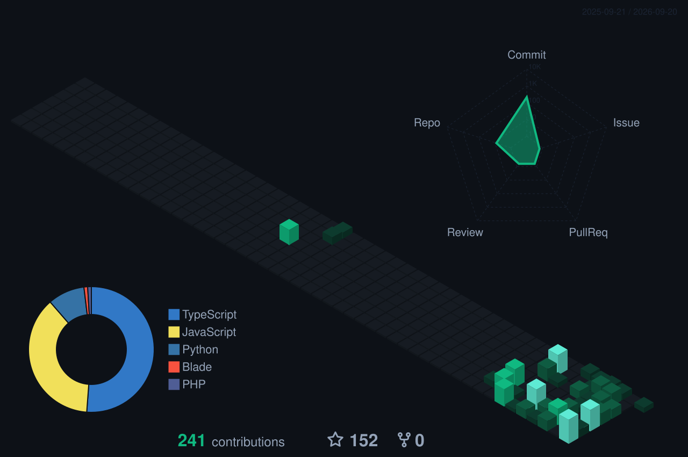

<!--
  Muhammad Saad — GitHub Profile README
  Theme: Deep teal/emerald dark tech — Accent #10b981 / #2dd4bf on #0d1117
  Auto-generated assets: profile-3d-contrib/ (3D graph), github-metrics.svg (analytics), output branch (snake) via GitHub Actions
-->

  

  

  

  <em>Building production-style web apps with the MERN stack.</em>

  

  
  
  

  

---

## ⚡ About Me

- 💻 Full stack developer working mainly in the **MERN stack** — React, Node.js, Express, MongoDB
- 🎓 Advanced Diploma in Software Engineering — **Aptech**, Karachi
- 🚀 Built **EventSphere**, a multi-role Event & Expo Management SaaS, and a **MERN-based POS System**
- 🎯 Prefer shipping something small end-to-end over half-finishing something impressive
- 📡 Comfortable across the stack — from REST APIs to responsive frontends

---

## 🧠 Tech Stack

  

  

---

## 🚀 Featured Projects

  
  

---

## 🔥 GitHub Analytics

  

Auto-generated daily by <code>.github/workflows/metrics.yml</code>

---

## 🧊 3D Contribution Graph

  

Auto-generated nightly by <code>.github/workflows/3d-contrib.yml</code>

---

## 🐍 Contribution Snake

  

Auto-generated on push by <code>.github/workflows/snake.yml</code>

---

## ⚙️ What I'm Building

- 🗓️ **EventSphere** — a full-stack MERN platform for managing events and expos across organizer, exhibitor, and attendee roles
- 🧾 **POS System** — a MERN-based point-of-sale app for handling sales, inventory, and receipts

---

## 🧬 Philosophy

Execution Over Words.

*"Code is a liability until it solves someone's actual problem."*

> *"Make it work, make it right, make it fast."*
>
> — Kent Beck

---

  

  

